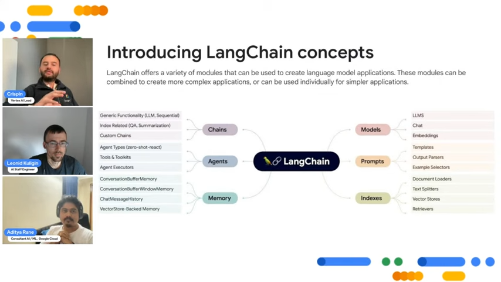

# Langchain Gemini
https://www.youtube.com/watch?v=vxF8-ay9Bzk with modification by 

## Agenda
1. The LangChain Project
2. Google and LangChain
3. Demo 1: LangChain Basic
4. Demo 2: Multimodal RAG
5. How to contribute


## Introducing LangChain

- An Open source modular framework for building application powered by language models
    - Chatbots and virtual assistants
    - Text generation and summarization
    - Document question answering
- Relies on language models to reason
- Connect a language model to sources of context (prompts, contextual content)
- Combines components (language models, agents, memory store) into complex workflows

## LangChain libraries and their advantages

LangChain main properties:
1. Components: modular building blocks that are ready and easy to use to build powerful applications. Components include LLM Wrappers, Prompt Template, and indexes for relevant information retrieval
2. Chains: Chains allow us to combine multiple component together to solve a specific task. Chain make implementation of complex application more modular and simple to debug and maintain
3. Agents: Agents allow LLMs to interact with their environment. For example, using an external API to perform a specific action 

LangChain benefit:
1. Increased productivity: simplified development with pre-built component and tools
2. Enhanced flexibility: adaptable to your specific needs and workflows; easy to swap out abstractions and component necessary to work with language models
3. Simplified integration: bring external data, files, other applications, and API data to LLMs
4. Scalability: can be used to build complex and large-scale application
5. Agents: allow LLMs to interact with their environment and use LLMs to help decide which action to take next

## LangChain Concepts


## LangChain Components

1. `Models` are the building block of LangChain providing an interface to different type of AI models. Large Language Models (LLMs), Chat and Text Embeddings models are supported model types.
2. `Prompts` refers to the input to the model, which is typically constructed from multiple components. LangChain provides interfaces to construct and work with prompts easily - Prompt Templates, Example Selector and Output Parsers
3. `Memory` provides a construct for storing and retrieving messages during a conversation which can be either short term or long term
4. `Indexes` help LLMs interact with documents by providing a way to structure them. LangChain provides Document Loaders to load documents, Text Splitters to split documents into smaller chunks, Vector Stores to store documents as embeddings, and Retrievers to fetch relevant documents.
5. `Chains` let you combine modular components (or other chains) in a specific order to complete a task
6. `Agent` are a powerful construct in LangChain allowing LLMs to communicate with external systems via Tools and observe and decide on the best course of action to complete a given task.

## LangChain and Google
### Vertex AI integration with LangChain

- Vertex AI and ChatVertexAI (Text Generation and Chat Models)
- VertexAIModelGarden (OSS Models on Vertex Model Garden)
- VertexEmbeddings (Text)

### Vertex AI PaLM API for text
The API allows you to structure your prompts by adding:
- Contextual information
- instruction
- Other types of text content
Useful for any task such as text classification, summarization, question answering, and more

```
from langchain.llms import VertexAI

llm = VertexAI(model_name='text-bison@001')
question = "What day comes after Friday?"
llm(question)
```

A specialized model tailored for chatbot development 

- Allows similar structured prompting to the text API

    - Contextual information
    - Instruction: e.g., regarding the response format, tone, and level of detail
    - Examples: to illustrate conversation flow
    - Other text content: include relevant keywords, domain-specific terms, or brand voice references

```
form langchain.chat_models import ChatVertexAI

chat = ChatVertexAI()
chat([SystemMessage(content=
                            "You suggest what to eat"),
    HumanMessage(content="I like tomatoes, what to eat?")])
```

### Vertex AI embeddings for text

- Accepts a document or text up to 3071 tokens
- Generates a 768 dimensional text embedding (floating point vector)
- Text embedding can be added to any vector store

```
from langchain.embeddings import VertexAIEmbeddings

embeddings = VertexAIEmbeddings()
text = "Embeddings = data representation."
text_embedding = embeddings.embed_query(text)
```

### Vertex AI Vector Search

- A fully managed vector store on Google Cloud
- Enables very fast vector search against embeddings added to its index with a key embedding
- Vertex AI Vector Search find the most similar vector from over a billion vectors
- Unlike vector stores that run locally, Matching Engine is optimized for scale (multi-million and billion vectors) and it's an enterprise ready vector store

```
from langchain.embeddings import VertexAIEmbeddings
from langchain.vectorstores import MatchingEngine

embedding = VertexAIEmbeddings()
me = MatchingEngine.from_components(
    project_id=ID, 
    region=REGION, 
    gcs_bucket_name = f'gs://{BUCKET_NAME}',
    embedding=embedding, 
    index_id=INDEX_ID,
    endpoint_id=INDEX_ENDPOINT_ID
)
```

### Example: Question/answering chain using plain text LLM (Text Bison or Gemini Text)

LangChain provides document loaders for CSVs, file directories, markdown, HTML, JSON, and PDFs. This example uses the Python PDF Loader


### Multimodal Retriever

